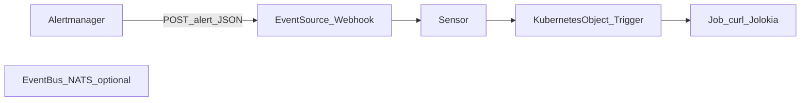

> **Canonical copy:** this file lives under `/Users/gmodzele/workspace/gmodzelewski/artemis-handbrake/docs/DESIGN.plan.md`. Edit here; legacy copy may remain under `~/.cursor/plans/` until removed.

---
name: Artemis Handbrake
overview: Use Kubernetes memory usage vs pod memory limit (~80%) to trigger Artemis address pause via Jolokia; resume when usage drops. Easiest path is Prometheus + Alertmanager webhook or a polling Deployment. A custom Go or Quarkus operator is optional when you want a CRD and continuous reconciliation—Go + Operator SDK is the default mainstream choice; Quarkus fits Java-centric teams.
todos:
  - id: clarify-metric
    content: "Confirm limit type: K8s CPU/mem vs custom metric vs broker capacity"
    status: completed
  - id: map-artemis-action
    content: "Confirm Artemis action: address pause vs address-settings vs queue pause"
    status: completed
  - id: choose-automation
    content: Pick Prometheus+webhook vs thin operator based on CRD/reconcile needs
    status: completed
  - id: secure-jolokia
    content: Design Secret, RBAC, NetworkPolicy for management API access
    status: pending
  - id: impl-receiver
    content: Implement webhook HTTP handler + Jolokia client + OpenShift manifests
    status: pending
  - id: impl-prom-rules
    content: Add PrometheusRule (pause/resume) + Alertmanager route to receiver URL
    status: pending
isProject: false
---

# Artemis Handbrake — memory gate for AMQ producers

**Catchy project name:** **Artemis Handbrake** — like a parking brake for producers when downstream memory runs hot.

**Suggested Git repository slug:** `artemis-handbrake` (also works as the binary/Helm chart short name).

**Alternatives if the slug is taken:**

| Name | Repo slug | Vibe |
|------|-----------|------|
| MemBrake | `membrake` | Short, literal |
| Producer Red Light | `producer-redlight` | Traffic metaphor |
| Jolokia Brake | `jolokia-brake` | Implementation-forward |

Use one slug consistently for the Go module (e.g. `github.com/<org>/artemis-handbrake`) and container image name.

# Memory-based pause of new Artemis producers on OpenShift

## Locked requirements

- **Signal:** Kubernetes **memory working set vs pod memory limit**, e.g. **pause when ≥ ~80%** for a sustained window.
- **Effect:** **Artemis address pause** (no credit for new producers); **resume** only after memory **drops** back (needs a lower threshold so producers are allowed again).
- **Preference:** **Easiest** solution, not a custom CRD/operator unless you outgrow simpler options.

## Recommendation (easiest first)

### Option A — Prefer this if User Workload Monitoring / Prometheus is already there

**PrometheusRule + Alertmanager webhook → minimal HTTP service → Jolokia**

1. **Recording rule or alert expression** using classic pod metrics, e.g. ratio of `container_memory_working_set_bytes` to `kube_pod_container_resource_limits{resource="memory"}` for your target workload (label your Deployment/Pods so the query is stable).
2. **Two alerts** (avoids flapping):
  - **Pause:** ratio **≥ 0.8** with `for: 5m` (tune as needed) → webhook calls Jolokia **pause** on the target address (idempotent OK).
  - **Resume:** ratio **≤ ~0.65–0.7** with `for: 2–5m` → webhook calls Jolokia **resume**.
3. **Tiny receiver** (Deployment + Service): validates Alertmanager payload, maps alert name → pause vs resume, POSTs to Jolokia with credentials from a **Secret**.

Why this is usually easiest: no reconcile loop, no Operator SDK, no CRD; ops teams already know Prometheus alerts; threshold and `for:` duration live in Git as YAML.

**Do not** extend the Red Hat AMQ Broker Operator for this—it stays upgrade-safe.

### Option B — If you do not have Prometheus / cannot add rules

**Single small Deployment** (script or minimal service) on a timer:

- Every **30–60s**, read **Metrics API** (`metrics.k8s.io`) for pod memory and **API server** for pod/container **limits**, compute ratio for the watched pods, apply hysteresis (pause ≥80%, resume ≤70%), call Jolokia pause/resume.

More code in one place, but **one container image** and **no** Alertmanager routing.

### Option C — Your own custom operator (when complexity is justified)

Use a **custom operator** when you want, for example:

- A **CRD** in GitOps (e.g. `BrokerThrottlePolicy`) describing *which* Deployment/Pods to watch, **thresholds**, **broker service**, **address name**, and **hysteresis**—without editing Prometheus rules or redeploying a different ConfigMap per change.
- **Continuous reconciliation**: periodically or on related object changes, recompute memory ratio and **enforce** desired broker state (pause vs resume) even if someone manually resumed the address.
- **Multi-namespace or shared platform** patterns where a **single maintained component** is easier to standardize than many webhook Deployments.

**Signal inside the operator:** you still need **metrics**, not only watches. Typical patterns:

- **Prometheus query API** from the operator (cluster Prometheus or Thanos); or
- **Metrics API** + pod spec **limits** (same math as Option B), inside the reconcile or a timed poll.

**Go vs Quarkus**

|                            | **Go (Operator SDK + controller-runtime)**                                | **Quarkus (Java Operator SDK)**                                     |
| -------------------------- | ------------------------------------------------------------------------- | ------------------------------------------------------------------- |
| **Ecosystem**              | De facto standard for K8s operators; largest example set, OLM/bundle docs | Mature; Red Hat–friendly; smaller operator-specific ecosystem vs Go |
| **OpenShift fit**          | Core platform controllers are Go; easy to hire/for patterns               | Strong if the team already ships Quarkus on OpenShift               |
| **Boilerplate**            | `kubebuilder`/`operator-sdk` scaffolds CRD + reconcile loop               | Similar scaffolding via Quarkus extensions                          |
| **HTTP client to Jolokia** | Straightforward (`net/http` or small client)                              | Straightforward (REST Client, Mutiny)                               |

**Practical recommendation:** choose **Go** unless your team **standardizes on Java/Quarkus** and will own this long-term in that stack. Both are valid; **Go lowers friction** for tooling, docs, and copying patterns from other operators.

### Not recommended as “easiest”

- **Custom operator / CRD** when you only need **one namespace and one policy**: Options A or B stay simpler.
- **Raw Pod watch only:** watches do not stream memory percentage; you still need metrics polling or Prometheus inside whatever you build.

## Artemis action (unchanged)

Invoke **AddressControl pause/resume** over **Jolokia** (or JMX) using broker admin credentials; keep access narrow (**NetworkPolicy**, **Secret**, RBSA).

## OpenShift notes

- **User Workload Monitoring:** enable if alerts must see your namespace metrics; configure **Alertmanager** receiver for the webhook URL (cluster networking/TLS per your policy).
- **Hysteresis is mandatory** at 80% target so pause/resume does not oscillate.
- Ensure the webhook handler is **idempotent** (calling pause twice or resume twice should be safe).

## Summary

| Your situation                         | Easiest fit                                                                  |
| -------------------------------------- | ---------------------------------------------------------------------------- |
| Prometheus/UWM available               | **Option A:** PrometheusRule + Alertmanager webhook + tiny Jolokia caller    |
| No Prometheus                          | **Option B:** One polling Deployment (Metrics API + limits + Jolokia)        |
| CRD + reconcile + GitOps policy object | **Option C:** Custom operator—**Go** default, **Quarkus** if Java-first team |

**Bottom line:** A **custom operator (Go or Quarkus)** is a **good** approach when you want a **declarative CRD and steady enforcement**, not when you only want the **minimum moving parts**—then **A** or **B** wins. Between languages, **prefer Go** for operator ergonomics unless **Quarkus is already your platform standard**.

---

## Implementation plan: Alertmanager webhook receiver → Jolokia

This section is the concrete build plan for the **tiny receiver** (Option A). No code has been written in this workspace; follow these steps in your repo or OpenShift project.

### 1. Behaviour contract

- **Inputs:** HTTP `POST` from Alertmanager (`/api/v1/alerts` webhook format), JSON body with `status` and `alerts[]` (each alert has `labels`, `annotations`, `status` `firing` | `resolved`).
- **Mapping:** Use a stable `**alertname`** (or custom label such as `action=pause|resume`) to decide **pause** vs **resume**. Recommended: two alerts, e.g. `WorkloadMemoryHigh` → pause, `WorkloadMemoryLow` → resume (hysteresis lives in Prometheus, not in the receiver).
- **Idempotency:** On each webhook POST, process **all firing alerts** in the payload; call Jolokia **pause** or **resume** accordingly. Duplicate calls are acceptable; optionally read `isPaused` first to avoid noise (not required for correctness).
- **Resolved handling:** Either **ignore** `resolved` for the high alert and rely on the **low** alert to resume, or treat `resolved` on high only if you accept the risk of resuming before memory is truly low—**prefer two alerts** as in the main plan.
- **HTTP response:** Return **2xx** only after Jolokia returns success (or log and return 5xx so Alertmanager can retry per its config). Return **4xx** for malformed JSON.

### 2. Jolokia integration (Artemis)

- **Base URL:** From your broker Route/Service (example path prefix: `/console/jolokia` on the embedded console; confirm with your AMQ Broker image/operator docs—path may differ slightly).
- **Auth:** HTTP Basic from a **Secret** (same credentials as console/JMX admin).
- **CORS / Origin:** Default Artemis Jolokia may require an `**Origin`** header (see [Artemis management docs](https://github.com/apache/activemq-artemis/blob/main/docs/user-manual/management.adoc)). Configure the HTTP client to send a fixed `Origin` header matching what `jolokia-access.xml` allows (often a configured origin, or align with your broker operator’s Jolokia settings).
- **MBean for address control:** ObjectName pattern:
  `org.apache.activemq.artemis:broker="<brokerName>",component=addresses,address="<yourAddress>"`
  **`brokerName`** matches `<broker-name>` in `broker.xml` (examples often use `0.0.0.0`; on Kubernetes it may match the pod/broker name—**verify** in your deployment, e.g. via console or one-off `list` MBean query).
- **Operations:** JMX `pause()` and `resume()` on `AddressControl` (no arguments for the void overload). Jolokia **exec** POST body shape (same family as Artemis docs):
  - `type`: `"exec"`
  - `mbean`: full string above with escaped quotes as required by JSON
  - `operation`: `"pause"` or `"resume"`
  - `arguments`: `[]`
- **Errors:** Log Jolokia JSON error field; surface failures so on-call can see failed webhooks in Alertmanager or pod logs.

### 3. Receiver implementation (language)

- **Suggested stack:** **Go** single binary (`net/http` + `encoding/json`) or **Python** FastAPI/Flask if your team prefers—keep it **one process, one port**, minimal dependencies.
- **Endpoints:**
  - `POST /webhook` — Alertmanager receiver (primary).
  - `GET /healthz` — liveness/readiness for OpenShift.
- **Configuration (env vars, backed by ConfigMap/Secret):**
  - `JOLOKIA_URL` — base URL including path to jolokia endpoint.
  - `JOLOKIA_ORIGIN` — value for `Origin` header if required.
  - `JOLOKIA_USER` / `JOLOKIA_PASSWORD` — from Secret.
  - `BROKER_NAME` — JMX broker name segment.
  - `ARTEMIS_ADDRESS` — address to pause/resume.
  - `ALERT_PAUSE_NAME` / `ALERT_RESUME_NAME` — match `labels.alertname` (or use one env `ACTION_LABEL` if you prefer custom labels).
- **Concurrency:** Serialize Jolokia calls with a **mutex** or small queue so overlapping alerts do not interleave oddly.

### 4. OpenShift artefacts

- **Deployment:** Run as **non-root**, read-only root filesystem if possible, **resource requests/limits** small.
- **Service:** ClusterIP for Alertmanager to call (same namespace as monitoring route, or expose Route if Alertmanager is outside).
- **Secret:** Jolokia credentials; optional second Secret for **webhook HMAC** or **Bearer token** validation if you add it.
- **NetworkPolicy:** Allow ingress only from **Alertmanager** pods or the platform monitoring namespace (label-based egress/ingress rules as your cluster allows); egress only to **broker Service** on Jolokia port.
- **Route (optional):** Only if Alertmanager cannot reach a ClusterIP; prefer internal cluster URL.

### 5. Alertmanager configuration

- Add a **receiver** pointing to `http://<service>.<namespace>.svc:8080/webhook` (or HTTPS Route).
- **Route:** Match labels so only the two workload memory alerts hit this receiver (avoid fan-out of unrelated alerts).
- Tune `**repeat_interval`** so a stuck firing alert does not hammer Jolokia unnecessarily (pause is idempotent, but logs get noisy).

### 6. PrometheusRule (sketch)

- **Pause alert:** expression for memory ratio **≥ 0.8**, `for: 5m`, unique `alertname` aligned with `ALERT_PAUSE_NAME`.
- **Resume alert:** ratio **≤ 0.7**, `for: 3m`, unique `alertname` aligned with `ALERT_RESUME_NAME`.
- Label selectors must pin the **exact Deployment/Pods** you care about (e.g. `deployment=consumer-xyz`).

(Exact PromQL depends on whether metrics come from **platform** or **user workload** Prometheus and metric relabeling—validate in the Prometheus UI before cutover.)

### 7. Testing checklist

- Unit test: parse sample Alertmanager JSON fixtures; assert correct Jolokia operation chosen.
- Integration (staging): fire a **manual test alert** or temporarily lower thresholds; confirm broker address **isPaused** via Jolokia read or console.
- Failure: wrong password → receiver returns 5xx; Alertmanager shows delivery errors.
- Soak: ensure no thrash at boundary (adjust `for:` and resume threshold if needed).

### 8. Alternative: run the Jolokia action as a Job on each alert

**Is it possible?** **Partially.** Alertmanager only supports **HTTP receivers** (and a few built-in integrations); it **cannot** create a `Job` object in Kubernetes by itself. You always need **something** that receives the webhook and calls the **Kubernetes API** to create a `Job`, **unless** you adopt a higher-level event system (e.g. **Argo Events** `Sensor` → `Kubernetes` trigger) that already maps webhooks to object creation.

**Pattern A — Minimal “Job launcher” + ephemeral Job (common compromise)**

- Keep a **very small long-lived** Deployment (or single-replica Service) whose **only** job is: validate Alertmanager POST → `**POST`/`create` a `Job`** via in-cluster `client-go` (or `kubectl` in a wrapper image).
- The `**Job` spec** uses a **tiny image** (e.g. `curlimages/curl` or your own 10-line script) that runs once: **HTTP POST to Jolokia** (pause or resume), then **exit 0**.
- Pass **pause vs resume** via **Job labels**, **Job name prefix**, or **environment** built from alert labels in the launcher (e.g. two alert names → two different `Job` templates or env `ACTION=pause`).

**Why people do this:** the **credentials and Jolokia client** live in short-lived pods; the long-lived surface is reduced to “create Job + RBAC for `create jobs` in namespace.”

**Operational caveats**

- **Startup latency:** pause happens **after** Job schedule + pull + run (often **several seconds** vs milliseconds from a Deployment receiver). Usually acceptable for **memory %** alerts with `for: 5m`.
- **Alert repeats:** each firing notification may create **another Job**—use `**ttlSecondsAfterFinished`**, `**activeDeadlineSeconds**`, and optionally **launcher-side deduplication** (e.g. skip create if a Job with label `correlation-id` already Running for this alert fingerprint in last N minutes).
- **Concurrency:** two Jobs calling `pause`/`resume` concurrently is usually OK if operations are idempotent; still prefer **serialized** creates from the launcher (mutex) or **single concurrent Job** policy.
- **Failures:** Job failure does not automatically map to Alertmanager retry unless the **launcher** returns **5xx** when Job creation fails; if the Job fails at runtime, rely on **Prometheus alert still firing** + **repeat_interval** + new Job, or **monitor Job status** from the launcher (more complex).

**Pattern B — No custom code: Argo Events / similar**

- Webhook Sensor creates the Job; same tradeoffs, different operator dependency.

**How Argo Events would look (conceptual)**

Argo Events is a Kubernetes-native event bus: **EventSource** ingests events, **Sensor** decides what to do, **Trigger** mutates the cluster (here: create a `Job`).

1. **Install:** [Argo Events](https://argoproj.github.io/argo-events/) controller + (optionally) **EventBus** (e.g. NATS) in your namespace. For a **single-namespace** webhook → Job flow, you can often use a **native** EventBus / minimal setup per docs for your version.
2. **EventSource (webhook):** Define a **webhook** EventSource that exposes an HTTP URL (Route or Ingress in OpenShift). Alertmanager **receiver** `webhook_configs` points to that URL. The payload is still the standard Alertmanager JSON; you may use **context** or **header** filters if the EventSource supports them.
3. **Sensor:** Subscribes to the EventSource. **Filters** (data filters / expr) match:
  - `alertname` for **pause** vs **resume**, or
  - two separate Sensors / two triggers with mutually exclusive filters.
4. **Trigger — Kubernetes object:** Use the **Kubernetes** (or **K8s resource**) trigger template to `**create`** a `Job` manifest. Map fields from the incoming event into the Job (e.g. pass `pause` vs `resume` as **env** on the Job pod by extracting from JSON with Sensor **parameters** / **jq** filters / `dataTemplate` depending on Argo Events version).
5. **Job spec:** Same as Pattern A: small image, `curl` POST to Jolokia with Basic auth from **Secret** (referenced by Job or projected volume). **ServiceAccount** for the Job only needs **network** egress to the broker, not `create jobs` (the **Sensor’s** SA needs permission to create Jobs).
6. **RBAC:** **Sensor** ServiceAccount: `create`/`get` `jobs` (and `delete` if you use resource labels for cleanup). **EventSource** pod: receives HTTP. Tighten **NetworkPolicy** so only Alertmanager (or your monitoring namespace) can POST to the webhook Route.
7. **Compared to a custom launcher Deployment:** You **replace hand-written Job-creation code** with **declarative YAML** (Sensor + triggers). You still run **Argo Events controllers** (ongoing operators in the cluster). Operational cost shifts to **maintaining Argo Events** vs **maintaining a tiny Go/Python service**.
8. **Failure / retry:** Configure Sensor/trigger **retryPolicy** per Argo Events docs; Alertmanager may still retry webhook **5xx** independently—align timeouts so you do not double-create Jobs without filters.

**When to choose Argo Events:** You already run **Argo** in the cluster, or you want **YAML-only** automation and multiple event sources later. For **only** this one alert → Job path, a **minimal launcher** is often less moving parts than adopting Argo Events.

**Recommendation vs long-lived receiver:** Use **Job-per-alert** when you want **short-lived credentials execution** or **audit trail per run** in Job logs. Use a **direct Jolokia Deployment** when you want **lowest latency** and **simplest** path. Both still need a **webhook entrypoint** (or event platform) because Alertmanager does not talk to the kube-apiserver.

### 9. Out of scope for the tiny receiver

- Replacing Prometheus (receiver does not scrape kube-state-metrics).
- Broker CR edits via AMQ Operator (still unnecessary for pause/resume).

---

Plan updates only; implementation happens in your OpenShift/Git repo when you leave plan mode and build the artefacts above.